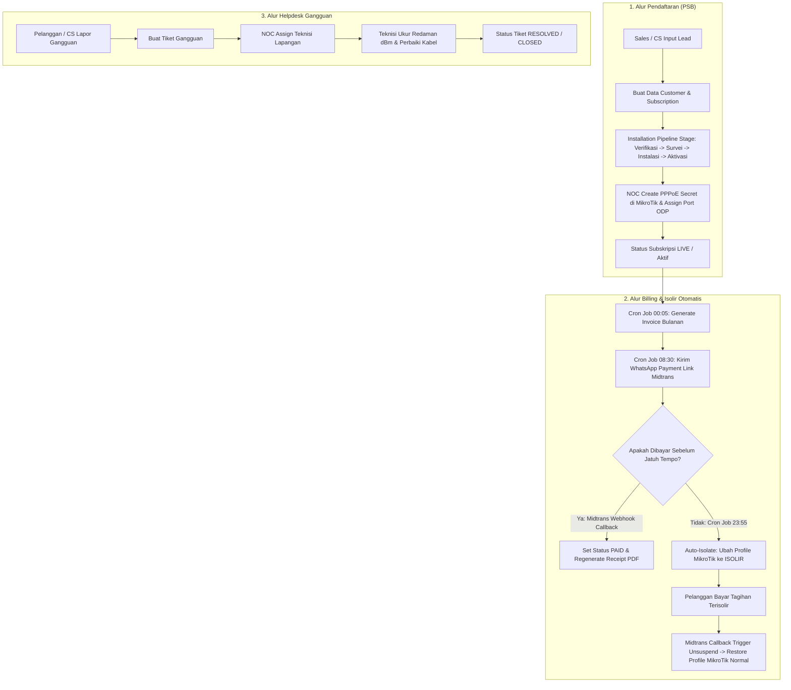

# 📖 Dokumen Panduan: Alur Kerja & Fungsi Halaman Aplikasi IMS MSN

> **Sistem Informasi Manajemen Operasional, Billing & Network FTTH ISP**  
> *Panduan Komprehensif Alur Bisnis, Otomasi Sistem, dan Penjelasan Fungsi Per Halaman Panel Admin*

---

## 📄 Daftar Isi
1. [Gambaran Umum Aplikasi](#1-gambaran-umum-aplikasi)
2. [Alur Bisnis & Kerja Utama (Business Workflows)](#2-alur-bisnis--kerja-utama-business-workflows)
   - [A. Alur Pendaftaran Pelanggan Baru (PSB / Pipeline)](#a-alur-pendaftaran-pelanggan-baru-psb--pipeline)
   - [B. Alur Tagihan Bulanan & Pembayaran (Recurring Billing)](#b-alur-tagihan-bulanan--pembayaran-recurring-billing)
   - [C. Alur Jatuh Tempo, Isolir Otomatis & Unsuspend MikroTik](#c-alur-jatuh-tempo-isolir-otomatis--unsuspend-mikrotik)
   - [D. Alur Helpdesk & Tiket Gangguan Jaringan](#d-alur-helpdesk--tiket-gangguan-jaringan)
   - [E. Alur Mutasi Paket & Pemutusan Layanan (Terminasi)](#e-alur-mutasi-paket--pemutusan-layanan-terminasi)
3. [Penjelasan Fungsi Per Halaman (Filament Admin Panel)](#3-penjelasan-fungsi-per-halaman-filament-admin-panel)
4. [Matriks Hak Akses Pengguna (RBAC)](#4-matriks-hak-akses-pengguna-rbac)

---

## 1. Gambaran Umum Aplikasi

**IMS MSN** adalah sistem manajemen operasional ISP (Internet Service Provider) berbasis FTTH (Fiber to the Home). Aplikasi ini mengintegrasikan seluruh lini kerja ISP:
- **Pelanggan & Sales**: Pencatatan data prospek area, data KTP pelanggan, dan langganan internet.
- **Teknisi & Jaringan**: Pemantauan pipeline pemasangan baru (PSB), topologi ODP (Optical Distribution Point), POP, serta tiket gangguan.
- **Billing & Finance**: Otomasi pembentukan invoice bulanan, integrasi payment gateway Midtrans (QRIS/VA), dan pencetakan kwitansi PDF.
- **NOC & MikroTik**: Otomasi integrasi API MikroTik RouterOS untuk pembuatan PPPoE Secret, eksekusi pemblokiran (isolir tunggakan), dan pemulihan otomatis saat lunas.
- **WhatsApp Gateway**: Pengiriman notifikasi tagihan otomatis, reminder jatuh tempo, dan pesan broadcast gangguan.

---

## 2. Alur Bisnis & Kerja Utama (Business Workflows)

---

### A. Alur Pendaftaran Pelanggan Baru (PSB / Pipeline)
1. **Input Prospek / Lead**: Sales atau Customer Service menerima pendaftaran dari calon pelanggan.
2. **Pembuatan Data Induk**: Penginputan NIK KTP pada menu **Master Pelanggan**, lalu membuat entri **Langganan Pelanggan** dengan status `REG` (Registrasi).
3. **Proses Pipeline Pemasangan (`InstallationPipelineResource`)**:
   - **Verifikasi**: Pemeriksaan kelengkapan data & pembayaran biaya pasang baru (`RegistrationInvoice`).
   - **Survei Lapangan**: Teknisi menguji jarak kabel optic dan ketersediaan port ODP terdekat.
   - **Instalasi**: Tim teknisi menarik kabel dropcore ke rumah pelanggan dan memasang perangkat ONT/Modem.
   - **Aktivasi**: NOC memverifikasi redaman optik (dBm), menginput akun PPPoE di MikroTik, dan mengubah status langganan menjadi `LIVE`.

### B. Alur Tagihan Bulanan & Pembayaran (Recurring Billing)
1. **Generate Invoice Otomatis**: Setiap tanggal 1 bulan baru (pukul 00:05 WIB), sistem menjalankan `GenerateMonthlyInvoicesJob` untuk memproduksi tagihan berdasarkan paket internet masing-masing pelanggan.
2. **Notifikasi WhatsApp**: Pukul 08:30 WIB, `SendInvoiceRemindersJob` secara otomatis mengirim rincian tagihan beserta link pembayaran online Midtrans langsung ke nomor WhatsApp pelanggan.
3. **Pembayaran Online**: Pelanggan membayar via QRIS, Transfer Bank VA, atau Kasir. Webhook `/api/midtrans/notification` menangani callback dan memperbarui status menjadi `PAID`.

### C. Alur Jatuh Tempo, Isolir Otomatis & Unsuspend MikroTik
1. **Deteksi Tunggakan**: Pukul 23:55 WIB, `AutoIsolateOverdueCustomersJob` mengecek invoice berstatus `UNPAID` yang telah melewati tanggal jatuh tempo.
2. **Eksekusi Isolir**: Sistem mengubah `is_isolated = true` di database dan memanggil `MikrotikService::isolateUser()`. MikroTik mengubah profil PPPoE pelanggan menjadi `PROFILE-ISOLIR` serta menendang sesi aktif agar redirect ke halaman pemberitahuan tunggakan.
3. **Unsuspend Otomatis**: Saat pelanggan membayar lunas invoice tersebut, webhook Midtrans memanggil `MikrotikService::restoreUser()`, mengembalikan profil PPPoE ke kecepatan normal tanpa perlu intervensi manual staff NOC.

### D. Alur Helpdesk & Tiket Gangguan Jaringan
1. **Pelaporan**: CS atau pelanggan membuat laporan di menu **Tiket Gangguan** (`TicketResource`) dengan memilih kategori (misal: *LOS / Kabel Putus*, *Internet Lambat*, *Masalah Billing*).
2. **Penugasan Teknisi**: Staff NOC menganalisa laporan dan menugaskan teknisi lapangan.
3. **Perbaikan & Pengukuran**: Teknisi mengukur redaman optic (dBm) menggunakan OPM, memperbaiki sambungan kabel, dan mengunggah foto bukti.
4. **Penyelesaian**: Tiket diperbarui menjadi `RESOLVED` dan sistem mengirimkan notifikasi ke pelanggan.

### E. Alur Mutasi Paket & Pemutusan Layanan (Terminasi)
- **Mutasi Paket**: Pelanggan meminta upgrade/downgrade bandwidth. Disetujui via **Mutasi Paket Bandwidth** (`PackageMutationResource`), yang secara otomatis memanggil `MikrotikService::changeProfile()` untuk memperbarui profil kecepatan di MikroTik.
- **Terminasi**: Jika pelanggan berhenti berlangganan, dibuat laporan **Pemutusan Layanan** (`ServiceTerminationResource`) untuk menugaskan teknisi menarik perangkat ONT & kabel dropcore.

---

## 3. Penjelasan Fungsi Per Halaman (Filament Admin Panel)

Seluruh modul dikelompokkan dalam menu navigasi Filament Admin Panel ([http://127.0.0.1:8080/admin](http://127.0.0.1:8080/admin)):

| No | Nama Menu / Halaman | URL Path | Fungsi Utama |
| :---: | :--- | :--- | :--- |
| **1** | **Dashboard Executive** | `/admin` | Menampilkan widget ringkasan statistik: total pelanggan aktif, total tagihan terbayar, tiket gangguan open, dan grafik operasional. |
| **2** | **Master Pelanggan** | `/admin/customers` | Mengelola data kependudukan induk pelanggan (NIK KTP, Nama, No. HP, Alamat KTP, RT/RW, Kelurahan) dan melihat seluruh riwayat langganannya. |
| **3** | **Langganan Pelanggan** | `/admin/customer-subscriptions` | Pusat kontrol akun internet pelanggan. Mengatur Nomor Internet, status langganan (LIVE, REG, ISOLIR, TERMIN), kredensial PPPoE, alokasi ODP & port, siklus billing, dan diskon. |
| **4** | **Pipeline Pemasangan Baru (PSB)** | `/admin/installation-pipelines` | Monitoring alur wizard pendaftaran baru (Verifikasi $\rightarrow$ Survei $\rightarrow$ Instalasi Dropcore $\rightarrow$ Aktivasi). Dilengkapi form upload foto KTP, foto rumah, & titik GPS. |
| **5** | **Invoice Bulanan** | `/admin/monthly-invoices` | Mengelola tagihan rutin bulanan. Fitur: Filter status (`UNPAID`, `PAID`, `OVERDUE`), cetak Kwitansi/Invoice PDF, tombol *Generate Midtrans Link*, dan adjustment potongan denda/diskon. |
| **6** | **Invoice Registrasi** | `/admin/registration-invoices` | Mengelola tagihan biaya pendaftaran & pasang baru (PSB) untuk pelanggan baru sebelum aktivasi. |
| **7** | **Tiket Gangguan / Helpdesk** | `/admin/tickets` | Mengelola komplain pelanggan, penugasan teknisi lapangan, pencatatan nilai redaman optik (dBm), priority level, dan status penyelesaian tiket. |
| **8** | **Mutasi Paket Bandwidth** | `/admin/package-mutations` | Pencatatan permohonan dan riwayat penyesuaian paket internet pelanggan (upgrade/downgrade kecepatan). |
| **9** | **Isolir & Suspension** | `/admin/service-suspensions` | Menampilkan log dan eksekusi pemblokiran sementara layanan internet (akibat menunggak tagihan atau permintaan pelanggan). |
| **10** | **Pemutusan Layanan (Terminasi)** | `/admin/service-terminations` | Mengelola proses penutupan akun langganan permanen dan pencatatan berita acara penarikan perangkat modem/ONT. |
| **11** | **Paket Bandwidth** | `/admin/bandwidth-packages` | Katalog paket internet yang ditawarkan (misal: Home 20 Mbps, Biz 50 Mbps), harga bulanan, kecepatan (Mbps), dan biaya pasang. |
| **12** | **Master ODP & Topologi** | `/admin/odps` | Mengelola lokasi ODP (Optical Distribution Point), jumlah kapasitas port (8 / 16 port), alokasi port terpakai, dan POP penyuplai. |
| **13** | **Data Karyawan** | `/admin/employees` | Database internal staf perusahaan (NIK Karyawan, Divisi, Jabatan, Email Kantor, No. HP, & Status Kontrak). |
| **14** | **Divisi / Departemen** | `/admin/departments` | Master data unit kerja perusahaan (Management, Finance, NOC, Teknisi Lapangan, Customer Service, Sales, IT). |
| **15** | **Jabatan** | `/admin/positions` | Master data jenjang posisi/jabatan dalam setiap divisi. |
| **16** | **Manajemen User** | `/admin/users` | Mengelola akun login pengguna sistem, email, status aktif, dan **penetapan Role/Hak Akses Spatie** (dropdown role). |
| **17** | **Roles & Permissions (Shield)** | `/admin/shield/roles` | Antarmuka visual Filament Shield untuk mengatur matriks hak akses detail per modul bagi setiap role di sistem. |

---

## 4. Matriks Hak Akses Pengguna (RBAC)

Hak akses setiap halaman dan fitur dibatasi secara ketat berdasarkan Role akun yang login:

| Modul / Resource | Super Admin | Direktur / Management | Finance & Billing | NOC / Network Support | Teknisi Lapangan | Customer Service / Helpdesk | Sales / Marketing |
| :--- | :---: | :---: | :---: | :---: | :---: | :---: | :---: |
| **Dashboard Executive** | ✅ Full | 👁️ View Only | ❌ | ❌ | ❌ | ❌ | ❌ |
| **Master Pelanggan** | ✅ Full | 👁️ View | 👁️ View | 👁️ View | 👁️ View | ✅ Full (CRUD) | 👁️ View |
| **Langganan Pelanggan** | ✅ Full | 👁️ View | 👁️ View | ✏️ Update | 👁️ View | ✏️ Update | ➕ Create (Draft) |
| **Pipeline Pemasangan (PSB)** | ✅ Full | 👁️ View | 👁️ View | ✏️ Verifikasi | ✏️ Eksekusi Lapangan | 👁️ View | ➕ Input Baru |
| **Invoice Registrasi & Bulanan** | ✅ Full | 👁️ View | ✅ Full + Bayar | 👁️ View | ❌ | 👁️ View | 👁️ View |
| **MikroTik RouterOS & ODP** | ✅ Full | ❌ | ❌ | ✅ Full + Isolir | 👁️ View ODP | ❌ | ❌ |
| **Helpdesk & Tiket Gangguan** | ✅ Full | 👁️ View | 👁️ View | ✏️ Assign/Analisa | ✏️ Progress Lapangan | ✅ Full (Buat/Update) | 👁️ View |
| **Kepegawaian & User Systems** | ✅ Full | 👁️ View | ❌ | ❌ | ❌ | ❌ | ❌ |

*Keterangan:*  
- ✅ **Full**: Memiliki akses penuh (Create, Read, Update, Delete).  
- 👁️ **View**: Hanya dapat melihat data (Read-Only).  
- ✏️ **Update**: Mengubah status, memverifikasi, atau mengeksekusi tahapan kerja.  
- ➕ **Create**: Membuat draft entri data baru.  
- ❌ **No Access**: Menu disembunyikan dan diproteksi dari akses langsung.
